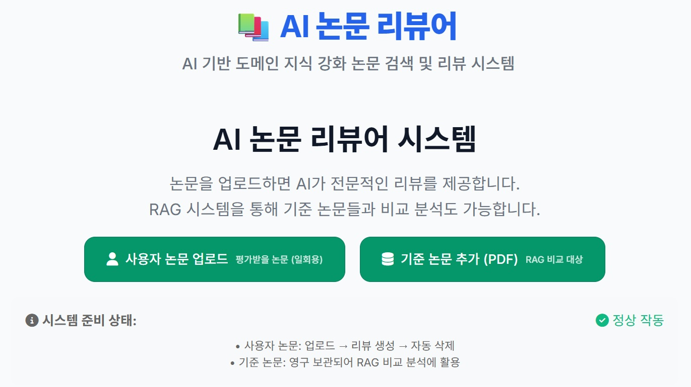
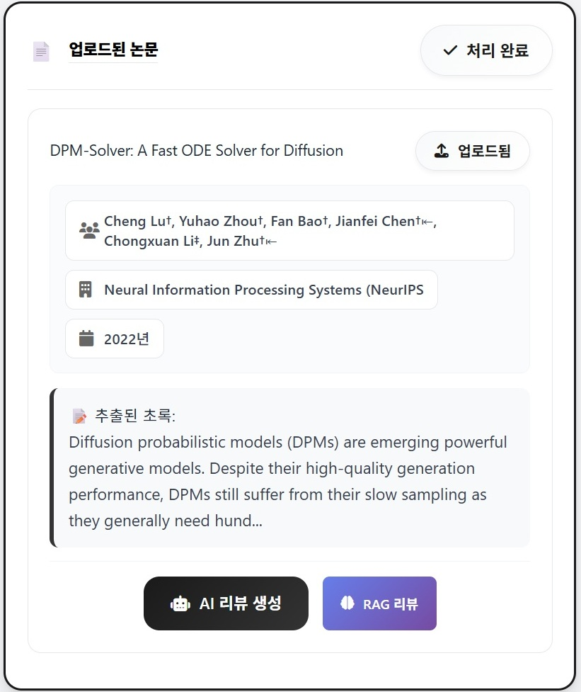
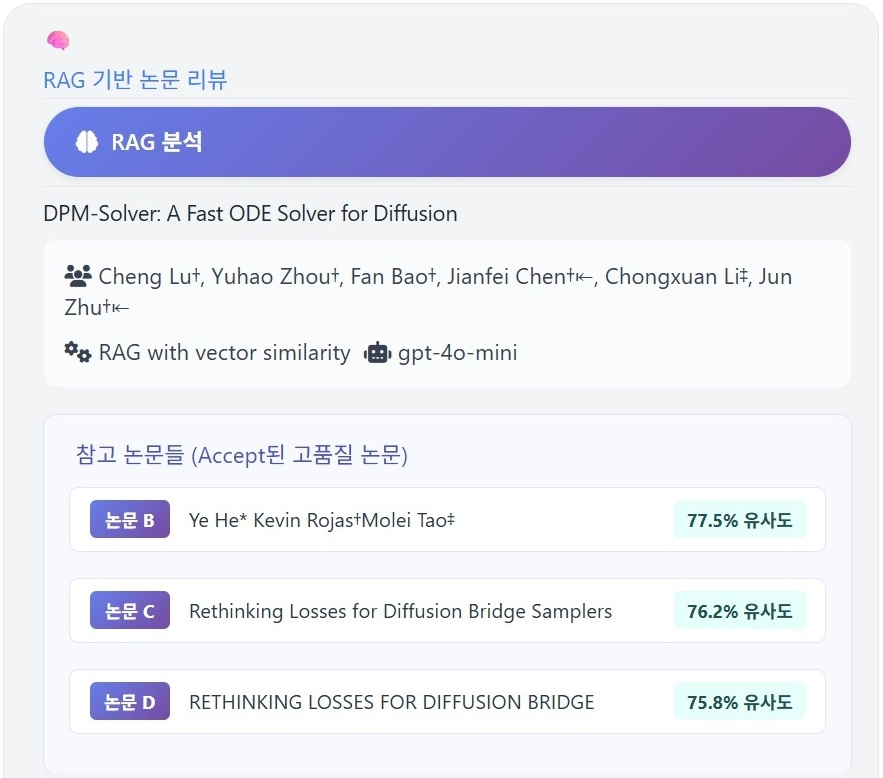
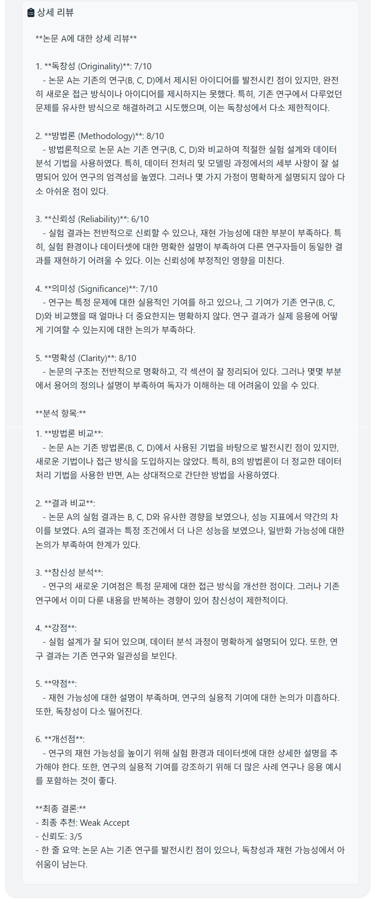

# Hybrid Database–Based LLM Paper Reviewer

A **Spring 2025 team course project (Team 18)** exploring retrieval-assisted literature review. The prototype combines PDF ingestion, paper metadata and database storage, similarity/embedding retrieval, and LLM-generated review drafts. It exposes a FastAPI interface with paper, upload, embedding, and review endpoints.

This repository represents the **team's project**, not a claim that one person wrote every component. Team members agreed to publication. No individual contribution breakdown is asserted here.

## Research idea

```text
paper PDF / metadata → parsing and storage → candidate reference retrieval
                     → comparison context → structured review draft
```

The intent was to compare a target paper with related literature and surface possible strengths, weaknesses, and questions for a human reviewer. Generated reviews are drafts and can be wrong; they must not substitute for reading the papers or for peer review.

## Prototype walkthrough

Screenshots from the Spring 2025 course submission show the historical interface and an example workflow. They are illustrative outputs, not a validation of review accuracy.

1. **Start a review.** Upload a paper for a one-time review, or add reference papers for retrieval-based comparison.

   

2. **Inspect the parsed paper.** The interface displays extracted metadata and offers AI-review and RAG-review actions.

   

3. **Compare with related papers.** The RAG view lists retrieved references with similarity scores before presenting a generated review.

   

<details>
<summary>View an example generated review</summary>



</details>

## Run locally

This is a historical prototype, not a maintained hosted service. The dependency versions reflect the original coursework and may require a Python 3.10/3.11 environment or adjustment on newer systems.

```bash
python -m venv .venv
# Activate the environment for your shell.
python -m pip install -r requirements.txt
# Optional: copy .env.example to .env and set your own API key.
python -m uvicorn app.main:app --host 127.0.0.1 --port 8000
```

Open `http://127.0.0.1:8000/docs` for the API. A local SQLite database is created at runtime. AI review endpoints require an API key and may incur usage charges. Some routes depend on third-party services or an initialized paper collection. The public snapshot has passed Python syntax compilation, but it has not been fully integration-tested with external services.

## Publication boundary

The original submission contained a real API key in `.env`; it is **not** included here and must be revoked separately. This repository includes only selected interface screenshots; it excludes the course submission archive, private database, uploaded paper files, reports, and presentation files. Do not deploy this historical code publicly as-is: it has permissive development CORS/settings and has not received a production security review.

There is no claim of being the first system of its kind. The meaningful portfolio point is that our team explored a retrieval-plus-LLM review workflow during Spring 2025.
